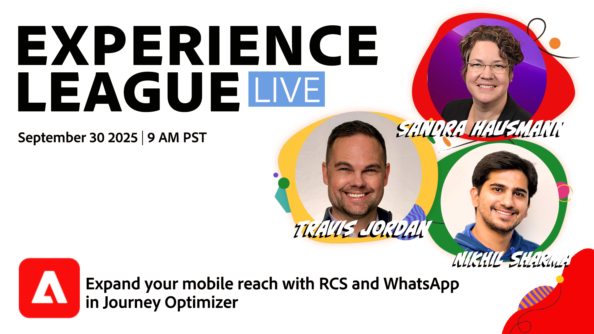

# 在Journey Optimizer中使用RCS和WhatsApp扩大您的移动范围

在这个Experience League Live节目中，Travis Jordan和Nikhil Sharma将展示Adobe Journey Optimizer最近如何通过强大的新渠道添加和功能（包括WhatsApp、RCS和自定义短信提供商）扩展移动参与。

了解如何提供丰富且个性化的移动体验，这些体验超越纯文本，具有交互式按钮、轮播、快速回复等功能 — 所有这些都是通过这些新渠道直接在Journey Optimizer中编排的。 我们将介绍RCS与WhatsApp之间的优势和区别，如何设置这些新渠道（包括API凭据和Webhook），以及如何将这些渠道合并到您现有的全渠道参与策略中。

> 

[立即注册！](https://engage.adobe.com/ExpLeagueLive-250930.html)
