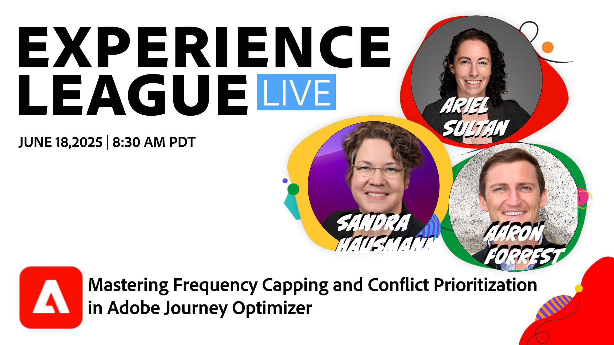
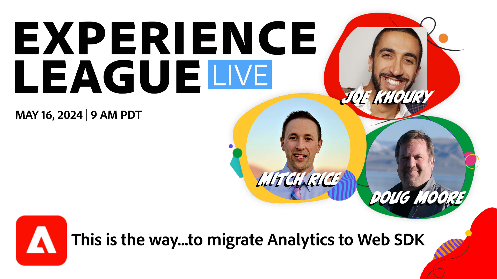

# Experience League LIVE

Experience League LIVE是Experience League团队制作的直播节目。  利用这个机会，您可以与Adobe产品专家联系，并学习可用于Adobe Experience Cloud应用程序的可操作性提示、技巧和策略。

## 即将举行的Experience League LIVE活动

<table>
    <tr>
        <td style="vertical-align: top;">
            

              <a href="episodes/exl-live-episode-47-2025-06-05.md">
                <strong>大规模个性化内容的Agile工作流</strong>
              </a>
               <em>与Amarnath Vannarath、Chris Ivory和Rohan Bhatt</em>
               <em>2025年6月05日</em>
            

        </td>
        <td style="vertical-align: top;">
            

              <a href="episodes/exl-live-episode-06-18-25.md">
                <strong>主频率上限和冲突优先级</strong>
              </a>
               <em>与Sandra Hausmann、Ariel Sultan、Aaron Forrest和Keara Fausett</em>
               <em>2025年6月18日</em>
            

        </td>
    </tr>

</table>

## 员工精选

<table style="max-width: 1214px;">

<tr>
  <td style="vertical-align: top;">
    

      <a href="episodes/exl-live-episode-06-26-24.md">
        <strong>最新Adobe Real-Time CDP版本如何推动您的业务发展</strong>
      </a>
       <em>与Nina Caruso、Rudi Shumpert和Doug Moore一起</em>
       <em>2024年6月26日</em>
    

  </td>

<td style="vertical-align: top;">
    
    

      <a href="episodes/exl-live-episode-05-16-24.md"><strong>这是将Analytics迁移到Web SDK的方式</strong></a>
       <em>与Mitch Rice、Joe Khoury和Doug Moore</em>
       <em>2024年5月16日</em>
    

  </td>

<td style="vertical-align: top;">
    
    

      <a href="episodes/exl-live-episode-04-24-24.md">
        <strong>在Journey Optimizer中新增基于代码的体验渠道</strong>
      </a>
       <em>与Sandra Hausmann、Robert Calangiu和Brent Kostak</em>
       <em>2024年4月24日</em>
    

  </td>
  </tr>

</table>

>[!TIP]
>
>如需其他学习方法，请查看我们的免费[课程](https://experienceleague.adobe.com/#dashboard/learning)以及个人[教程](https://experienceleague.adobe.com/docs/home-tutorials.html?lang=zh-Hans)。

