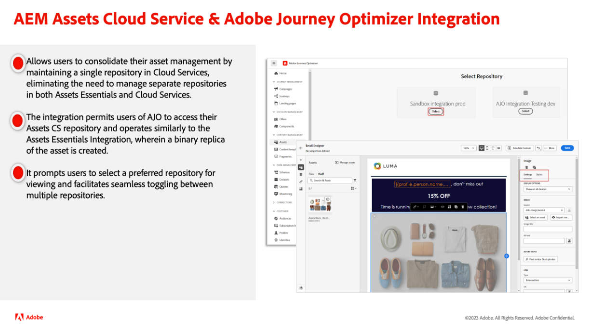

# Adobe Experience Manager as a Cloud Service版本更新

快速大致了解Adobe Experience Manager as a Cloud Service的最新功能。 这些是AEM产品团队提供的简短视频，时长约为10分钟，其中介绍了最新版本的主要功能。

## 最新更新

<table style="max-width: 50%;">
  <tr>
    <td>
      
      

        <a href="2024/2024-5-0.md">
          <strong>版本 | 2024.5.0</strong>
        </a>
      

      <em>发行日期2024年5月 </em>
      

        <a href="https://experienceleague.adobe.com/docs/experience-manager-cloud-service/content/release-notes/release-notes/release-notes-current.html?lang=zh-Hans">发行说明</a>
      

    </td>
  </tr>  
</table>

## 过去的更新

<table style="max-width: 50%;">
  <tr>
    <td>
      
      

        <a href="2024/2024-4-0.md">
          <strong>版本 | 2024.4.0</strong>
        </a>
      

      <em>发行日期2024年4月 </em>
    </td>
    <td>
      
      

        <a href="2024/2024-3-0.md">
          <strong>版本 | 2024.3.0</strong>
        </a>
      

      <em>发行日期2024年4月 </em>
    </td>
    <td>
      
      

        <a href="2024/2024-1-0.md">
          <strong>版本 | 2024.1.0</strong>
           
        </a>
          <em>发行日期2024年1月 </em>
      

    </td>
  </tr>
  <tr>
    <td>
      
      

        <a href="2023/2023-11-0.md">
          <strong>版本 | 2023.11.0</strong>
           
        </a>
          <em>发行日期2023年11月 </em>
      

    </td>
    <td>
      
      

        <a href="2023/2023-10-0.md">
          <strong>版本 | 2023.10.0</strong>
           
        </a>
          <em>发行日期2023年10月 </em>
      

    </td>
    <td>
      
      

        <a href="2023/2023-9-0.md">
          <strong>版本 | 2023.9.0</strong>
           
        </a>
          <em>发行日期2023年9月 </em>
      

    </td>
  </tr>
  <tr>    
    <td>
      
      

        <a href="2023/2023-8-0.md">
          <strong>版本 | 2023.8.0</strong>
           
        </a>
          <em>发行日期2023年8月 </em>
      

    </td>
    <td>
      
      

        <a href="2023/2023-7-0.md">
          <strong>版本 | 2023.7.0</strong>
           
        </a>
          <em>发行日期2023年7月 </em>
      

    </td>
    <td>
      
      

        <a href="2023/2023-6-0.md">
          <strong>版本 | 2023.6.0</strong>
           
        </a>
          <em>发布日期2023年6月 </em>
      

    </td>
  </tr>
</table>
